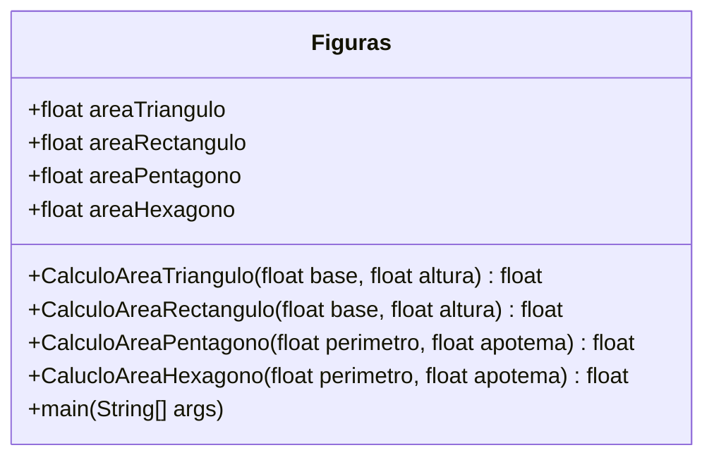

# Figuras geométricas

## diagrama de clase



## diagrama de flujo

```mermaid
flowchart
    id1((inicio))--> id2[\Dime una figura\]-->id3[/figura/]-->id4{triángulo}
    id4-->id5[\Introduce el valor de la base\]
    id5-->id6[/base/]
    id4-->|no|id7{rectángulo}
    id6-->id8[\Introduce el valor de la altura\]
    id8-->id9[/altura/]
    id9-->id10(CalculoAreaTriangulo)
    id10-->id111[\El área del triángulo es + CalculoAreaTriangulo\]
    id7-->id12[\Introduce el valor de la base\]
    id12-->id13[/base/]
    id13-->id14[\Introduce el valor de la altura\]
    id14-->id15[/altura/]
    id15-->id16(CalculoAreaRectangulo)
    id16-->id17[\El área del rectángulo es + CalculoAreaRectángulo\]
    id7-->|no|id18{pentágono}
    id18-->id19[\Introduce el valor del perímetro\]
    id19-->id20[/perímetro/]
    id20-->id21[\Introduce el valor del apotema\]
    id21-->id22[/apotema/]
    id22-->id23(CalculoAreaPentagono)
    id23-->id24[\El área del pentágono es + CalculoAreaPentágono\]
    id18-->|no|id25{hexágono}
    id25-->id26[\Introduce el valor del perímetro\]
    id26-->id27[/perímetro/]
    id27-->id28[\Introduce el valor del apotema\]
    id28-->id29[/apotema/]
    id29-->id30(CalculoAreaHexagono)
    id30-->id31[\El área del hexágono es + CalculoAreaHexágono\]
    id25-->|no|id32[\La figura introducida no existe\]
    id32------->id33((fin))
    