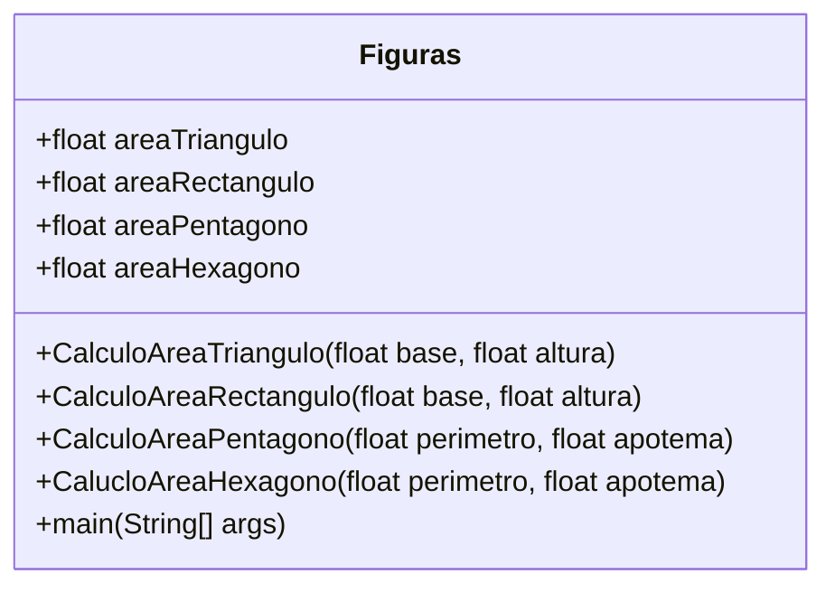

# Figuras geométricas

## diagrama de clase

```mermaid
classDiagram
class Figuras
Figuras : +float areaTriangulo
Figuras : +float areaRectangulo
Figuras : +float areaPentagono
Figuras : +float areaHexagono
Figuras : +CalculoAreaTriangulo(float base, float altura)
Figuras : +CalculoAreaRectangulo(float base, float altura)
Figuras : +CalculoAreaPentagono(float perimetro, float apotema)
Figuras: +CalucloAreaHexagono(float perimetro, float apotema)
Figuras: +main(String[] args)
```